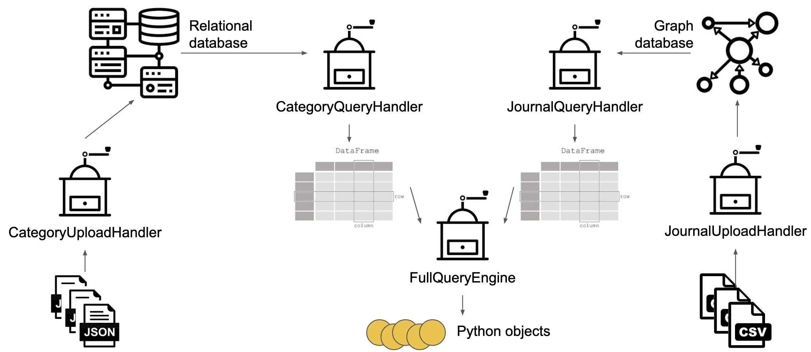
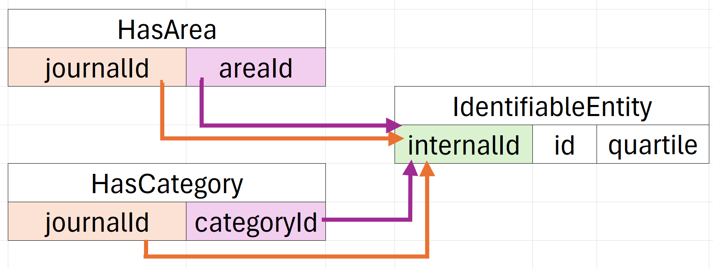
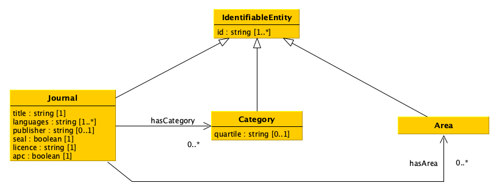

# 📘 Brigata — DHDK 2025
### Scholarly Journal Integration & Query Engine

## 🎯 Project Goal

This project integrates scholarly journal metadata coming from two heterogeneous sources:

- **a graph database** (Blazegraph + RDF triples)
- **a relational database** (SQLite)

and exposes a unified Python query engine that returns results as Python objects (`Journal`, `Category`, `Area`).
The architecture is modular, extensible, and designed to support heterogeneous data ingestion and querying.

---

## 📚 Data Sources

### Graph Database (CSV → RDF → Blazegraph)

- Source: *Directory of Open Access Journals (DOAJ)*
- Contains: ISSN, title, languages, publisher, license, APC, DOAJ Seal
- Loaded via: **JournalUploadHandler**

### Relational Database (JSON → SQLite)

- Source: *Scimago Journal Rank (SJR)*
- Contains: categories, areas, quartiles
- Loaded via: **CategoryUploadHandler**

---

## 🏗️ System Architecture

### Overall Workflow



**1. CategoryUploadHandler** loads JSON into the relational database (SQLite).
**2. JournalUploadHandler** loads CSV into the graph database (Blazegraph).
**3. CategoryQueryHandler** and **JournalQueryHandler** retrieve data as Pandas DataFrames.
**4. FullQueryEngine** integrates both sources and returns Python objects.

---

## 🗄️ Relational Database Schema



The schema includes:

- `IdentifiableEntity`
- `HasCategory`
- `HasArea`

This structure supports many-to-many relationships between journals, categories, and areas.

---

## 🧩 Python Data Model



### IdentifiableEntity

Base class for all entities with one or more identifiers.

### Journal

- title
- languages
- publisher
- seal
- license
- apc
- hasCategory
- hasArea

### Category

- id
- quartile

### Area

- id

---

## 🔍 Query Engine

### BasicQueryEngine

Provides simple filters:

- `getAllJournals()`
- `getJournalsWithTitle()`
- `getJournalsPublishedBy()`
- `getJournalsWithLicense()`
- `getJournalsWithAPC()`
- `getJournalsWithDOAJSeal()`
- `getAllCategories()`
- `getAllAreas()`
- `getCategoriesWithQuartile()`

### FullQueryEngine

Provides composite queries combining graph + relational data:

- `getJournalsInCategoriesWithQuartile()`
- `getJournalsInAreasWithLicense()`
- `getDiamondJournalsInAreasAndCategoriesWithQuartile()`

---

## 📦 Project Structure

```
your_project/
├── main.py
├── laura.py
├── Yang.py
├── daniele.py
├── li.py
├── baseHandler.py
├── test.py
├── images/
│   ├── pipeline.png
│   ├── relational_schema.png
│   ├── data_model.png
│   ├── uml_query_handlers.png
├── data/
│   ├── doaj.csv
│   ├── scimago.json
└── my_journals.db   # auto-generated
```

---

## ⚙️ Installation

Install dependencies:
```
pip install pandas rdflib SPARQLWrapper sqlalchemy
```

---

## 🔥 Running Blazegraph

Download Blazegraph:
```
wget https://github.com/blazegraph/database/releases/download/BLAZEGRAPH_2_1_6_RC/blazegraph.jar
```

Start the server:
```
java -server -Xmx1g -jar blazegraph.jar
```

Verify:
```
http://localhost:9999/blazegraph/
```

---

## 🚀 Running the Project

```
python main.py
```

This will:

- upload CSV to Blazegraph
- upload JSON to SQLite
- initialize the query engine
- run example queries

---

## 👥 Team Members

| Name | Role | Email |
|------|------|-------|
| **Tianchi Yang** | Graph Query Handler (SPARQL) | tianchi.yang@studio.unibo.it |
| **Yihua Li** | Graph Upload Handler (RDF → Blazegraph) | yihua.li@studio.unibo.it |
| **Daniele Camagna** | Relational DB + Upload Handler | daniele.camagna@studio.unibo.it |
| **Laura Bortoli** | Query Engine (Basic & Full) | laura.bortoli@studio.unibo.it |
